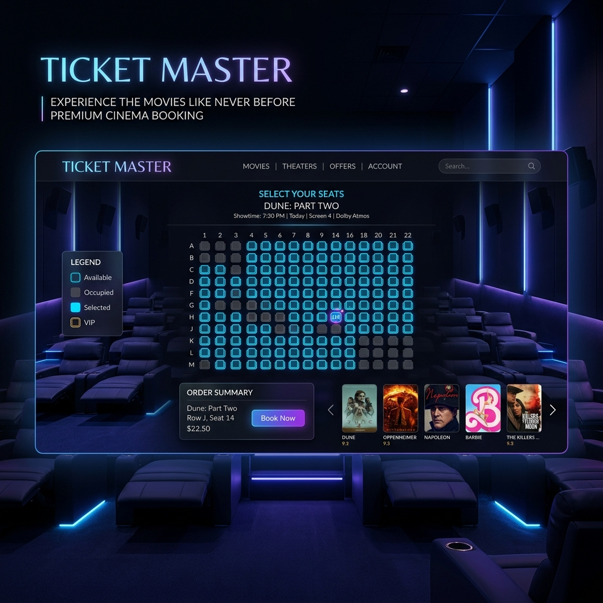

# 🎬 Ticket Master - Premium Movie Booking Experience



Ticket Master is a high-end, modern movie reservation platform designed for a seamless and immersive user experience. Built with the latest web technologies, interactive seat selection, and a robust booking management system.

## ✨ Key Features

- **🚀 Cinematic Home Page**: Features a dynamic hero section with trending movies and a sleek navigation bar.
- **📅 Smart Date Picker**: Integrated date and showtime selection for easy planning.
- **🪑 Interactive Seat Map**: Real-time seat selection with distinct statuses (Available, Selected, Taken).
- **📱 Fully Responsive**: Optimized for desktop, tablet, and mobile devices.
- **🔍 Detailed Movie Insights**: Comprehensive movie details including genre, duration, and descriptions.
- **🎟️ Booking Management**: View and manage your movie reservations in one place.
- **⏲️ Real-time Countdown**: Session-based booking timers for enhanced urgency.

## 🛠️ Tech Stack

- **Frontend**: [React 19](https://react.dev/), [TypeScript](https://www.typescriptlang.org/)
- **Build Tool**: [Vite 7](https://vitejs.dev/)
- **Styling**: [Tailwind CSS 4](https://tailwindcss.com/) (using OKLCH colors)
- **State Management**: [Redux Toolkit](https://redux-toolkit.js.org/)
- **Routing**: [React Router 7](https://reactrouter.com/)
- **UI Components**: [Radix UI](https://www.radix-ui.com/)
- **Icons**: [Lucide React](https://lucide.dev/)
- **Animations**: [tw-animate-css](https://github.com/tony-v/tw-animate-css)

## 🚀 Getting Started

### Prerequisites

- [Node.js](https://nodejs.org/) (v18 or higher)
- [pnpm](https://pnpm.io/) (recommended) or npm/yarn

### Installation

1. **Clone the repository**:
   ```bash
   git clone https://github.com/Frost-is-me/Ticket-Master.git
   cd Ticket-Master
   ```

2. **Install dependencies**:
   ```bash
   pnpm install
   ```

3. **Start the development server**:
   ```bash
   pnpm dev
   ```

4. **Build for production**:
   ```bash
   pnpm build
   ```

## 📂 Project Structure

```text
src/
├── components/     # Reusable UI components (Navbar, SeatMap, etc.)
├── data/           # Mock movie and showtime data
├── hooks/          # Custom React hooks
├── lib/            # Utility functions and configurations
├── pages/          # Main application pages (Home, Booking, etc.)
├── store/          # Redux Toolkit state management
└── styles.css      # Global styles and Tailwind configuration
```

## 🎨 Design System

Ticket Master uses a sophisticated design system based on **OKLCH** color values for better color precision and accessibility. The theme supports both light and dark modes, with a primary focus on a premium dark cinematic aesthetic.

## 📄 License

This project is licensed under the MIT License - see the [LICENSE](LICENSE) file for details.

## 🤝 Contributing

Contributions are welcome! Please feel free to submit a Pull Request.

---
Built with ❤️ by [Frost-is-me](https://github.com/Frost-is-me)
